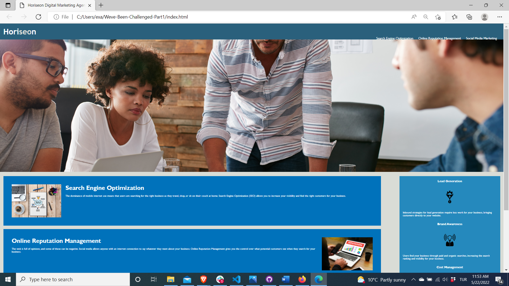

# Weve-Been-Challenged-Part1
 When Coding Bootcamp Challenges Me Part1 

 # Table of Contents 
 1. Introduction
 2. Site Url
 3. Key Topics 
 4. Screenshot(s)

 # 1. Introduction
 This readme will explain how the provided html and its codebase follows accessibility standards to achieve optimization in search engines. The methods used are as follows: (Please note that the following are not final, yet they are final to this version. In future versions .js, metadata extraction and blogging will be covered to achieve peak search engine optimizations)

 Given the code has been provided as .html and .css from Horiseon Marketing Agency we will use 2 (two) methods. 
 Method 1. Does the .html follow fundamental structure?
 Method 2. Does the .css follow fundamental structure?
 Once the above methods have been overlooked, this will provide a good backbone which can be later improvised upon as mentioned above earlier. 
 
 # 2. Site URL 
 https://kreatifbob.github.io/Weve-Been-Challenged-Part1/

 # 3. Key Topics for Method 1 & 2
 Are accessibility standards in place? Use of such and such 
 Are there semantic HTML elements in the source code?
 Do the elements follow a logical structure?

All in all the key topics covered are as follows;
HTML 
HTML Comments and Markups 
Header Navigation and ID Links 
Semantic elements, tags, attributes
HTML debug
CSS
Order of importance 
Consolidating(merging) selectors and properties
Positioning and floats 
Color: hexadecimal and named 
CSS Debug 

 # 4. Screenshot 
 See screeshot below to deployed URL
 

 
